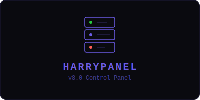

<div align="center">



# HarryPanel v8.0

> Advanced web hosting control panel — server management, database admin, file manager.

[](LICENSE)
[](https://github.com/ykrishhh/HarryPanel)

</div>

---

## Features

| Feature | Description |
|----------|-------------|
| Server Overview | CPU, memory, disk monitoring with real-time graphs |
| Process Manager | Top processes by CPU/memory usage |
| Service Monitor | Check status of system services |
| File Manager | Browse directories, view files |
| Database Admin | SQLite browser, query editor |
| Terminal | Remote shell with SocketIO |
| Deployment | Railway-ready with one-click deploy |

### Tech Stack

`Python` `Flask` `SocketIO` `SQLite` `HTML/CSS/JS`

### Quick Start

```bash
git clone https://github.com/ykrishhh/HarryPanel.git
cd HarryPanel/harry-backend
pip install -r requirements.txt
python app.py
```

Open `http://localhost:5000`

### Deploy to Railway

[](https://railway.com/new/template/HarryPanel)

Or manually:

```bash
railway login
railway init
railway up
```

## Contributing

Contributions welcome!

## License

[MIT License](LICENSE) — Built by [ykrishhh](https://github.com/ykrishhh)

---

<div align="center">

**Star this repo if you find it useful!** ⭐

</div>
